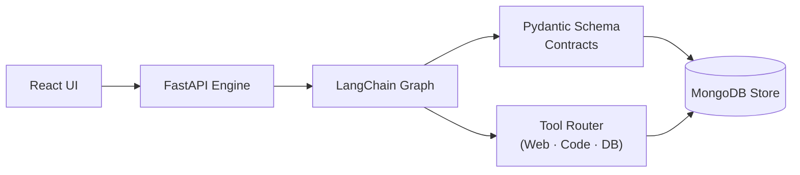
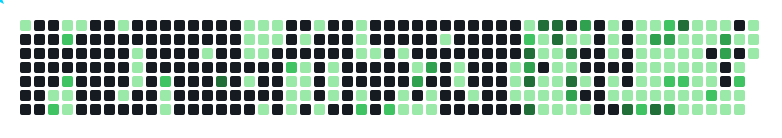

 

&nbsp;&nbsp;&nbsp;&nbsp;

 

&nbsp;&nbsp;&nbsp;

## 👤 About Me

<table>
<tr>
<td width="270" valign="top">

</td>
<td valign="top">

- **Roles** — Full-Stack Developer, AI Orchestration Developer *(learning & building)*, Backend Architect
- **Institution** — RKM Vidyamandira · CS Honours · 2025–2028
- **Location** — West Bengal, India 🇮🇳
- **Focus** — LLM Orchestration with LangChain, Agentic AI Systems & Pipelines, Distributed Backend Architecture, Open Source npm Ecosystem
- **Currently on** — npm package suite · OS contributions · GSoC prep
- **Learning** — Advanced TypeScript, Agent frameworks, Cybersecurity
- **Philosophy** — Systems that scale. Code that explains itself.
- **Open to** — Collaboration, Freelance, Open Source
- **Available** — ✅ Ping me anytime

</td>
</tr>
</table>

> ⚡ Shipped a multi-agent AI platform as a first-year CS student
> 📦 Production npm packages — CI/CD, Vitest, ESM+CJS dual build
> 🤖 Discord bots · automated video pipelines · weapon detection
> 🌐 Active dev on rkmvmfamily.in — real users, production code
> 🐧 Linux power user · 🛡️ Cybersecurity learner
> 📡 Hardware tinkerer (ESP32 / Arduino) · 🎥 Content creator

## 🧰 Tech Stack

**🧠 Languages**
 

**🤖 AI Orchestration & LLM**
 
&nbsp;&nbsp;&nbsp;&nbsp;&nbsp;

**⚙️ Backend & APIs**
 
&nbsp;&nbsp;&nbsp;

**🗄️ Databases**
 
&nbsp;&nbsp;

**🎨 Frontend**
 

**🛠️ DevOps & Infrastructure**
 
&nbsp;&nbsp;&nbsp;

**📦 Open Source Tooling**
 
&nbsp;&nbsp;&nbsp;&nbsp;

 

## 🚀 Featured Projects

### 🤖 Agentica AI — Multi-Agent Automation Platform

> An intelligent automation engine for production-grade LLM orchestration — composable agent graphs, async pipelines, and structured data contracts under one roof.

 

**Stack:** `FastAPI` · `LangChain` · `Pydantic` · `MongoDB` · `React` · `Vercel`

### 📦 npm Open Source Package Suite

> A tiered TypeScript package ecosystem — full ESM/CJS dual builds, Vitest coverage, automated CI/CD publish pipelines. Part of a long-term GSoC + open-source strategy.

| Package | What it does | Build | Status |
|:--------|:-------------|:-----:|:------:|
| [`typed-env`](https://npmjs.com) | Runtime env validator with full TS type inference | ESM + CJS | 🟢 Active |
| [`authz-js`](https://npmjs.com) | JWT + RBAC/permission middleware for Express | ESM + CJS | 🟢 Active |
| `retry-fetch` | Exponential backoff fetch with policy config | ESM + CJS | 🔵 Building |
| `rate-limit-queue` | Token bucket rate limiter + async queue | ESM + CJS | 🔵 Building |
| `schema-diff` | Deep structural diff engine for JSON schemas | — | 🔵 Building |
| `scrape-schema` | Declarative scraping with typed output schemas | — | 🟡 Planned |
| `sqlite-memory-adapter` | Lightweight SQLite adapter for in-memory use | — | 🟡 Planned |

### 🎯 More Projects

| Project | Stack | Highlights |
|:--------|:------|:-----------|
| 🎥 **Viral Video Pipeline** | `Gemini API` · `MoviePy` · `edge-tts` · `Pexels` | Fully automated script → voice → video. Discord bot on Railway for heavy processing |
| 🛡️ **YOLOv11 Sleeping Detector** | `Python` · `YOLOv11` · `Kaggle` | Hard negative training, TP/TN evaluation, multi-source dataset pipeline |
| 🤖 **Discord Analytics Bot** | `Discord.py` · `Railway` · `GitHub Actions` | Multi-cog: feeds, moderation, analytics, welcome. Migrated from HuggingFace |
| 📄 **AI Resume Analyser** | `LangChain` · `Python` | Structured resume parsing + LLM-powered feedback scoring |
| 🏫 **rkmvmfamily.in** *(Contributor)* | `PHP` · `JS` · `MySQL` | Production college community platform — real users, active development |

## 📊 GitHub Stats

## 🧊 3D Contribution Graph

<table>
<tr>
<td></td>
<td></td>
<td></td>
</tr>
</table>

## 🏅 Certifications

| 🏆 Certification | Issuer | Year | Credential |
|:----------------|:-------|:----:|:----------:|
| Software Engineering Virtual Experience | Electronic Arts × Forage | 2025 | [📄 View Certificate](https://www.theforage.com/completion-certificates/9PBTqmSxAf6zZTseP/E9pA6qsdbeyEkp3ti_9PBTqmSxAf6zZTseP_68de55396549cc2e44a61432_1759402906224_completion_certificate.pdf) |

## 🗺️ Roadmap

&nbsp;

&nbsp;

&nbsp;

